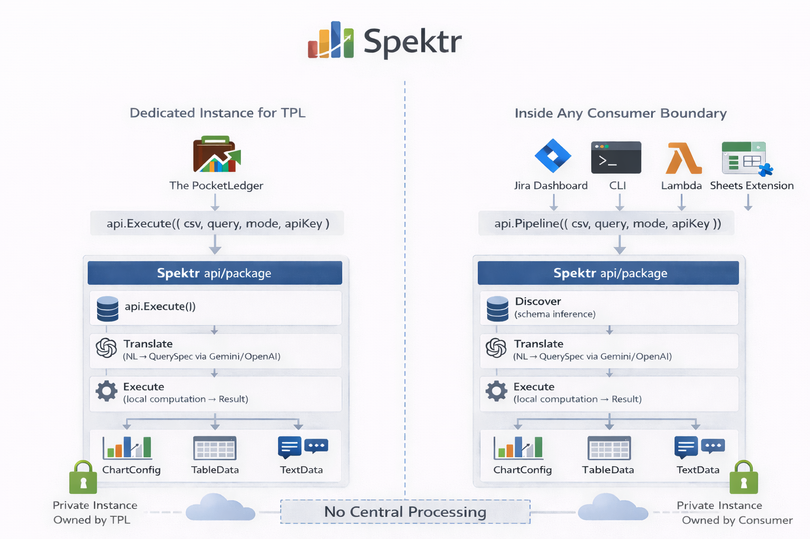

# Spektr

**Stateless, domain‑agnostic analytics engine for any structured dataset.**

Ask questions in natural language. Feed any CSV, sheet, or table. Get **charts, tables, or summaries** instantly.

Spektr is not a hosted service and not a SaaS platform.

Each consumer runs **its own private instance of the Spektr engine** inside its own infrastructure.

Examples of consumers:

- The PocketLedger (TPL)
- Jira dashboards
- CLI analytics tools
- AWS Lambda analytics services
- Google Sheets extensions
- internal enterprise dashboards

No shared servers. No centralized processing. No vendor lock‑in.

---

## Architecture

Spektr is a **stateless analytics engine** that runs inside the consumer’s environment.

Each application embeds its own instance of the engine.



### Key design principles

• **Consumer‑owned instances** — every consumer runs Spektr privately  
• **No central processing** — no shared service or hosted backend  
• **Stateless execution** — each request is independent  
• **AI optional** — analytics computation is always deterministic  

Execution pipeline:

```
Consumer App (TPL, Jira dashboard, CLI, Lambda, Sheets extension)
        │
        ▼
api.Pipeline({ csv, query, mode, apiKey })
        │
        ▼
Spektr api/ package
        ├── Discover   → schema inference
        ├── Translate  → NL → QuerySpec (AI optional)
        └── Execute    → local analytics computation
        │
        ▼
Result
 ├── ChartConfig
 ├── TableData
 └── TextData
```


---

## How Spektr Works Internally

Spektr operates as a **three‑stage analytics pipeline**.

```
CSV / Dataset
      │
      ▼
Discover
(schema inference)
      │
      ▼
Translate
(NL → QuerySpec)
      │
      ▼
Execute
(local analytics)
      │
      ▼
Result
(ChartConfig | TableData | TextData)
```

### 1. Discover — Schema Inference

Spektr automatically determines:

- **Dimensions** → grouping fields (category, status, region)
- **Measures** → numeric aggregations (amount, revenue, points)
- **Temporal fields** → time columns for trend analysis
- **High‑cardinality identifiers** → ignored (emails, IDs)

No schema definition required.

---

### 2. Translate — Natural Language → QuerySpec

User question:

```
show spending by category
```

Spektr generates:

```json
{
  "intent": "chart",
  "measure": "amount",
  "aggregation": "sum",
  "groupBy": ["category"],
  "visualize": "bar"
}
```

Translation modes:

| Mode | Description |
|-----|-------------|
Local | keyword interpretation |
AI | Gemini / OpenAI translation |

AI is optional.

---

### 3. Execute — Deterministic Analytics

Analytics always run locally.

```
QuerySpec
   │
   ▼
Group → Aggregate → Sort → Format
   │
   ▼
Result
```

Output types:

- ChartConfig
- TableData
- TextData


---

## 30‑Second Quickstart

### 1. Build the CLI

```
git clone https://github.com/spektr-org/spektr
cd spektr
go build -o spektr ./cmd/spektr/
```

### 2. Run analytics

```
spektr --file sales.csv --query "revenue by region"
```

Output:

```
Region   Revenue
APAC     120000
US       95000
EU       72000
```

### 3. Generate a chart CSV

```
spektr --file sales.csv        --query "revenue by region"        --format csv        --out chart.csv
```

Open `chart.csv` in:

- Google Sheets
- Excel
- Tableau

Instant chart.

### Optional AI mode

```
export GEMINI_API_KEY=your-key

spektr --file sales.csv        --query "which region is growing fastest?"
```

Spektr translates the query with Gemini but executes analytics locally.

---

## Real Dataset Demo

The same Spektr pipeline works across completely different domains.

### Jira Example

Dataset:

```
Assignee,Priority,StoryPoints,Sprint
Alice,P1,8,Sprint‑12
Bob,P2,3,Sprint‑12
Alice,P1,13,Sprint‑13
```

Query:

```
show story points by assignee
```

Result:

```
Alice   21
Bob      3
```

---

### Finance Example

Dataset:

```
Category,Field,Amount,Month
Expense,Rent,2500,Jan
Expense,Groceries,800,Jan
Income,Salary,8000,Jan
```

Query:

```
show expenses by category
```

Result:

```
Rent        2500
Groceries    800
```

---

### HR Example

Dataset:

```
Department,Salary,Location
Engineering,120000,Singapore
Finance,90000,Singapore
Engineering,130000,London
```

Query:

```
average salary by department
```

Result:

```
Engineering   125000
Finance        90000
```

---

Same engine. Same API. Any dataset.

```
CSV → Discover → Translate → Execute → Result
```


---

# Spektr

**Domain-agnostic analytics engine. Picolytics for any dataset.**

Spektr takes structured data from any domain — finance, project management, security operations, HR — and produces render-ready analytics output: charts, tables, and text summaries. Feed it a CSV, ask a question in plain English, get answers.

```bash
# Export CSV from Jira, Salesforce, your bank — anything
$ spektr --file jira-export.csv --query "show bugs by priority" --format csv --out results.csv

# Open results.csv in Google Sheets → instant chart
```

```
"Show spending by category"           →  AI Translator  →  QuerySpec  →  Spektr Engine  →  Chart CSV
"Average response time by severity"   →  same pipeline, different data
"Story points by sprint"              →  same pipeline, different data
```

## Why Spektr?

Most analytics libraries are tightly coupled to their domain. Spektr isn't. It operates on two primitives:

- **Dimensions** — string fields you group and filter by (category, status, location, month)
- **Measures** — numeric fields you aggregate (amount, story_points, response_time)

Any dataset that has these two things works with Spektr. No schema migration, no ETL pipeline, no database required.

## Architecture

Spektr is a **library that defines REST-shaped interfaces**. It never runs a server. Every function accepts a formally typed Request, returns a formally typed Response, and is JSON-serializable by contract. Transport is the consumer's concern entirely.

```
Spektr library (api/ package)
└── Functions with formally defined Request/Response types
     that are JSON-serializable by contract

Consumer's transport (their choice)
├── Lambda handler     → JSON event in, JSON out → calls api.Pipeline()
├── HTTP wrapper       → HTTP request  → calls api.Execute()  → HTTP response
├── WASM bridge        → JS calls function directly (already works)
├── Python / any lang  → HTTP POST + JSON → calls any deployed endpoint
├── Apps Script        → calls via HTTP wrapper → api.Translate()
├── Chrome extension   → WASM bridge → api.Discover()
└── CLI binary         → flag parsing → api.Pipeline() → stdout
```

The consumer's wrapper is 5-10 lines per endpoint — just parsing and serialization. Spektr does zero transport work.

```
┌──────────────────────────────────────────────────────────────────┐
│                     CONSUMER'S TRANSPORT                          │
│         (Lambda, HTTP mux, WASM bridge, Apps Script)              │
├───────────────────────────────────────────────────────────────────┤
│                     api/ — PUBLIC INTERFACE                        │
│                                                                   │
│  Health()     Discover()     Refine()      Parse()                │
│  Translate()  Execute()      Pipeline()                           │
│                                                                   │
│  Typed Request/Response structs (contract.go)                     │
│  Response envelope: { ok, data, error }                           │
├──────────┬──────────────┬──────────────┬─────────────────────────┤
│  engine  │  translator  │   schema     │  helpers                 │
│          │              │              │                          │
│  Query → │  NL → Query  │  Auto-Detect │  CSV parsing             │
│  Result  │  (Gemini,    │  (heuristic) │                          │
│  (local, │   OpenAI)    │              │                          │
│   no AI) │              │  Smart Refine│                          │
│          │              │  (one-time   │                          │
│  zero    │  bring your  │   AI enrich) │                          │
│  deps    │  own LLM     │              │                          │
└──────────┴──────────────┴──────────────┴─────────────────────────┘
              INTERNAL PACKAGES — not imported by consumers
```

Full interactive API documentation: **[Swagger UI](https://petstore.swagger.io/?url=https://raw.githubusercontent.com/spektr-org/spektr/main/Docs/swagger.yaml)** — opens in browser. OpenAPI 3.0 spec: **[`Docs/swagger.yaml`](Docs/swagger.yaml)**.

## Installation

### As a Go library

```bash
go get github.com/spektr-org/spektr
```

Requires Go 1.21+. Consumers import only the `api` package:

```go
import "github.com/spektr-org/spektr/api"
```

### As a CLI binary

```bash
git clone https://github.com/spektr-org/spektr
cd spektr
go build -o ./bin/spektr ./cmd/spektr/
```

### As an npm package

```bash
npm install @spektr/engine
```

### Build all targets

```bash
make build      # CLI binary → bin/spektr
make wasm       # WASM binary → bin/spektr.wasm
make npm        # Copy WASM + wasm_exec.js into npm/
make test       # Run Go tests
make test-npm   # Run Node.js WASM test
make all        # Everything
```

## Quick Start

### Option 1: One-Shot Pipeline (CSV → Question → Answer)

The simplest way to use Spektr. One function call, CSV in, result out.

```go
package main

import (
    "fmt"
    "github.com/spektr-org/spektr/api"
)

func main() {
    csv := `Category,Field,Month,Amount
Expense,Rent,Jan-2026,2500
Expense,Groceries,Jan-2026,800
Income,Salary,Jan-2026,8000`

    // One call — discovers schema, parses records, builds query, executes
    resp := api.Pipeline(api.PipelineRequest{
        CSV:   csv,
        Query: "sum amount by field",
        Mode:  api.PipelineModeLocal,
    })

    if !resp.OK {
        panic(resp.Error)
    }

    fmt.Println("Reply:", resp.Data.Result.Reply)
    fmt.Println("Type:", resp.Data.Result.Type)
    // ChartConfig, TableData available on resp.Data.Result
}
```

### Option 2: Pipeline with Natural Language (AI Mode)

Ask questions in plain English. Requires a Gemini or OpenAI API key.

```go
resp := api.Pipeline(api.PipelineRequest{
    CSV:    csv,
    Query:  "how much did I spend on rent compared to groceries?",
    Mode:   api.PipelineModeAI,
    APIKey: "AIza...",
    Model:  "gemini-2.5-flash",
})

if resp.OK {
    fmt.Println(resp.Data.Result.Reply)
    // "You spent 2,500.00 on Rent and 800.00 on Groceries."
}
```

### Option 3: Step-by-Step (Cache Schema, Reuse Across Queries)

For applications that run multiple queries against the same dataset, use the individual functions to avoid re-discovering the schema on every call.

```go
// Step 1: Discover schema (once per dataset shape)
discoverResp := api.Discover(api.DiscoverRequest{
    CSV:  csv,
    Name: "Monthly Budget",
})
schema := discoverResp.Data

// Step 2: Optionally enrich with AI (once, cache the result)
refineResp := api.Refine(api.RefineRequest{
    Schema: *schema,
    APIKey: "AIza...",
})
if refineResp.OK {
    schema = refineResp.Data
}

// Step 3: Parse records (once per dataset)
parseResp := api.Parse(api.ParseRequest{
    CSV:    csv,
    Schema: *schema,
})
records := parseResp.Data.Records

// Step 4: Translate natural language → QuerySpec (per query)
summary := api.SummaryFromRecords(records, *schema)
translateResp := api.Translate(api.TranslateRequest{
    Query:   "show expenses by category",
    Schema:  *schema,
    Summary: api.DataSummary{RecordCount: summary.RecordCount, Dimensions: summary.Dimensions},
    APIKey:  "AIza...",
})
spec := translateResp.Data.QuerySpec

// Step 5: Execute (per query — pure local computation, no AI)
executeResp := api.Execute(api.ExecuteRequest{
    Spec:    spec,
    Records: records,
})

fmt.Println(executeResp.Data.Reply)
fmt.Println(executeResp.Data.ChartConfig) // render-ready chart JSON
```

### Option 4: CLI — No Go Code Needed

```bash
export GEMINI_API_KEY=your-key
spektr --file sales.csv --query "revenue by region" --format csv --out results.csv
```

## API Contract

Every function in the `api/` package maps to one REST endpoint by design. All types are exported, JSON-tagged, and documented. Any consumer — regardless of transport — imports these same types.

### Endpoints

| Endpoint | Function | AI Call | Description |
|----------|----------|--------|-------------|
| `GET /health` | `api.Health()` | No | Version and readiness status |
| `POST /discover` | `api.Discover(req)` | No | CSV → schema (heuristic classification) |
| `POST /refine` | `api.Refine(req)` | Yes | Schema → enriched schema (one-time AI call) |
| `POST /parse` | `api.Parse(req)` | No | CSV + schema → `[]Record` |
| `POST /translate` | `api.Translate(req)` | Yes | Natural language → QuerySpec |
| `POST /execute` | `api.Execute(req)` | No | QuerySpec + records → Result |
| `POST /pipeline` | `api.Pipeline(req)` | Optional | One-shot: CSV + query → Result |

### Response Envelope

All responses use a generic envelope. `ok: true` → `data` is populated. `ok: false` → `error` is populated.

```go
type Response[T any] struct {
    OK    bool   `json:"ok"`
    Data  *T     `json:"data,omitempty"`
    Error string `json:"error,omitempty"`
}
```

### Consumer Transport Examples

The same `api.` functions work identically across all transports. The consumer's wrapper is 5-10 lines:

**AWS Lambda:**

```go
func handler(event events.APIGatewayRequest) (events.APIGatewayResponse, error) {
    var req api.PipelineRequest
    json.Unmarshal([]byte(event.Body), &req)
    resp := api.Pipeline(req)
    body, _ := json.Marshal(resp)
    return events.APIGatewayResponse{StatusCode: 200, Body: string(body)}, nil
}
```

**HTTP mux:**

```go
http.HandleFunc("/pipeline", func(w http.ResponseWriter, r *http.Request) {
    var req api.PipelineRequest
    json.NewDecoder(r.Body).Decode(&req)
    resp := api.Pipeline(req)
    json.NewEncoder(w).Encode(resp)
})
```

**WASM (already works):**

```javascript
const spektr = require('@spektr/engine');
await spektr.init();
const result = spektr.discover(csvString);  // same contract, JS bridge
```

**Python (calls any deployed Spektr endpoint):**

```python
import requests, json

SPEKTR_URL = "https://your-lambda-id.lambda-url.region.on.aws"

# One-shot pipeline — same contract as api.Pipeline()
resp = requests.post(f"{SPEKTR_URL}/pipeline", json={
    "csv": open("jira-export.csv").read(),
    "query": "show bugs by priority",
    "mode": "ai",
    "apiKey": "AIza..."
}).json()

if resp["ok"]:
    result = resp["data"]["result"]
    print(result["reply"])                    # "There are 12 bugs..."
    print(json.dumps(result["chartConfig"]))  # render-ready chart JSON

# Step-by-step — cache schema, run multiple queries
schema_resp = requests.post(f"{SPEKTR_URL}/discover", json={
    "csv": csv_content,
    "name": "Sprint Export"
}).json()
schema = schema_resp["data"]

parse_resp = requests.post(f"{SPEKTR_URL}/parse", json={
    "csv": csv_content,
    "schema": schema
}).json()
records = parse_resp["data"]["records"]

# Run multiple queries against cached records
for query in ["bugs by priority", "story points by assignee", "velocity by sprint"]:
    exec_resp = requests.post(f"{SPEKTR_URL}/translate", json={
        "query": query,
        "schema": schema,
        "summary": {"recordCount": len(records), "dimensions": {}},
        "apiKey": "AIza..."
    }).json()

    result = requests.post(f"{SPEKTR_URL}/execute", json={
        "spec": exec_resp["data"]["querySpec"],
        "records": records
    }).json()

    print(f"{query}: {result['data']['reply']}")
```

The JSON contract is identical across Go, JavaScript, and Python. No SDK needed — just HTTP + JSON.

One endpoint, unlimited domains:

```
┌─────────────────┐
│ Jira Sheet      │──┐
└─────────────────┘  │
┌─────────────────┐  │    ┌──────────────────┐
│ FinOps Sheet    │──┼───→│  Single Lambda    │──→ Gemini API
└─────────────────┘  │    │  (stateless)      │    (query → QuerySpec)
┌─────────────────┐  │    └──────────────────┘
│ Python script   │──┘
```

## CLI — The Fastest Way to Try Spektr

Build once, use on any CSV:

```bash
go build -o ./bin/spektr ./cmd/spektr/
export GEMINI_API_KEY=your-key
```

### Analyze any CSV

```bash
# Get CSV output ready for Google Sheets
spektr --file jira-export.csv --query "bugs by priority" --format csv --out bugs.csv

# Quick text answer
spektr --file sales.csv --query "total revenue" --format text

# Pretty JSON with full metadata
spektr --file hr-data.csv --query "average salary by department" --format pretty
```

### Auto-detect schema

```bash
# See what Spektr discovers from your data
spektr --file data.csv --discover --format pretty

# Enrich with AI (one-time, uses Gemini)
spektr --file data.csv --discover --refine --format pretty

# Save schema for reuse
spektr --file data.csv --discover --refine --out schema.json --format pretty

# Query with saved schema (faster — skips discovery)
spektr --file data.csv --schema schema.json --query "top 5 by total" --format csv
```

### Batch analysis

Use the included `spektr-analyze.sh` wrapper to run multiple queries at once:

```bash
chmod +x spektr-analyze.sh
./spektr-analyze.sh jira-export.csv                          # default output
./spektr-analyze.sh sales.csv /c/reports/output.csv          # custom output path
./spektr-analyze.sh data.csv results.csv gemini-2.5-flash-lite  # custom model
```

### CLI flags

| Flag | Description | Default |
|------|-------------|---------|
| `--file` | Input CSV file (required) | — |
| `--query` | Natural language query | — |
| `--discover` | Print auto-detected schema and exit | false |
| `--refine` | Apply Smart Refine (AI enrichment) | false |
| `--format` | Output: `json`, `pretty`, `text`, `csv` | `json` |
| `--out` | Write to file instead of stdout | stdout |
| `--schema` | Pre-built schema JSON (skips auto-detect) | — |
| `--model` | Gemini model name | `gemini-2.5-flash` |

## Schema Discovery

Spektr can figure out your data shape automatically — no manual schema definition needed.

### Auto-Detect (heuristic, no AI)

Analyzes CSV headers and values to classify columns:

```go
resp := api.Discover(api.DiscoverRequest{
    CSV:  csvContent,
    Name: "Jira Sprint Export",
})
schema := resp.Data
```

Auto-Detect handles: string dimensions, numeric measures, date/temporal detection, currency code recognition, hierarchy detection (e.g. sub_category → category), high-cardinality ID column skipping, and synthetic `record_count` measure injection.

**Column name intelligence** — columns named "points", "hours", "cost", "price", "salary", "score", "quantity" etc. are correctly classified as measures even when cardinality is low (e.g. story points: 1, 2, 3, 5, 8, 13). Units and default aggregations are inferred automatically:

| Column Name Contains | Unit | Default Aggregation |
|---------------------|------|-------------------|
| point, score, rating | points | avg |
| hour, duration, minute | hours | sum |
| cost, price, revenue, salary | currency | sum |
| percent, rate, ratio | percent | avg |
| count, quantity, qty | units | sum |

### Smart Refine (one-time AI enrichment)

Optionally sends ~500 bytes of column metadata to Gemini for enrichment — display names, descriptions, sort hints, unit corrections, hierarchy suggestions:

```go
resp := api.Refine(api.RefineRequest{
    Schema: discoveredSchema,
    APIKey: "AIza...",
    Model:  "gemini-2.5-flash-lite",  // optional
})
if resp.OK {
    enrichedSchema = resp.Data  // cache this — don't call Refine on every request
}
```

**Privacy guarantee:** Gemini only sees column names and sample values. Never raw data, never actual amounts. Smart Refine is called once at setup — cache the result and reuse.

What Smart Refine adds: dataset name and description, human-friendly display names, ordinal sort hints (e.g. "P1 > P2 > P3 > P4"), aggregation recommendations, hierarchy suggestions, recovery recommendations for skipped columns.

### Validated Across Domains

Auto-Detect has been validated with test suites across three distinct domains:

| Dataset | Dimensions | Measures | Skipped | Currency | Hierarchies |
|---------|-----------|----------|---------|----------|-------------|
| **Jira** (project management) | 10 | 4 | 2 | — | created→sprint |
| **E-commerce** (retail orders) | 9 | 6 | 1 | ✅ multi-currency | sub_category→category |
| **HR** (employee data) | 7 | 4 | 2 | — | — |

## Domain Examples

Spektr is domain-agnostic. The same `api.Pipeline()` call works on any CSV — just change the file and query.

### Jira / Project Management

```go
resp := api.Pipeline(api.PipelineRequest{
    CSV:    jiraCSV,
    Query:  "show story points by assignee",
    Mode:   api.PipelineModeAI,
    APIKey: "AIza...",
})
// Also works: "average time spent per priority level"
//             "sprint velocity trend by month"
//             "what percentage of bugs are critical?"
```

### Security Operations (SOAR / SIEM)

```go
resp := api.Pipeline(api.PipelineRequest{
    CSV:    soarCSV,
    Query:  "average response time by severity",
    Mode:   api.PipelineModeAI,
    APIKey: "AIza...",
})
// Also works: "show incident trend by month"
//             "which assignee handles the most critical incidents?"
//             "what percentage of incidents breached SLA?"
```

### FinOps / Cloud Cost

```go
resp := api.Pipeline(api.PipelineRequest{
    CSV:    awsCostCSV,
    Query:  "spend by service this month",
    Mode:   api.PipelineModeAI,
    APIKey: "AIza...",
})
```

### HR / People Analytics

```go
resp := api.Pipeline(api.PipelineRequest{
    CSV:    hrCSV,
    Query:  "average salary by department",
    Mode:   api.PipelineModeAI,
    APIKey: "AIza...",
})
// Also works: "headcount by location"
//             "show hiring trend by month"
```

### Personal Finance

```go
resp := api.Pipeline(api.PipelineRequest{
    CSV:    bankCSV,
    Query:  "how much did I spend on rent in Singapore?",
    Mode:   api.PipelineModeAI,
    APIKey: "AIza...",
})
// Also works: "show income vs expenses by month"
//             "what percentage of salary was transferred to India?"
```

## Core Types

These types are defined in the `engine` package and referenced by the `api` contract. Consumers interact with them through `api.ExecuteRequest`, `api.TranslateResult`, and `api.PipelineResult`.

### QuerySpec — What to Compute

```go
type QuerySpec struct {
    Intent         string   // "text", "table", "chart"
    Filters        Filters  // Which records to include
    CompareFilters *Filters // For ratio queries (numerator)
    Aggregation    string   // "sum", "count", "avg", "max", "min", "list", "growth", "ratio"
    Measure        string   // Which measure to aggregate
    GroupBy        []string // Dimension keys to group by
    SortBy         string   // "value_desc", "value_asc", "date_asc", etc.
    Limit          int      // Max groups (0 = all)
    Visualize      string   // "bar", "line", "pie", "table", "text"
    Title          string   // Chart/table title
    Reply          string   // Template: "You spent {total} on {filter_label}"
    Confidence     float64  // 0.0–1.0 (from AI translator)
}
```

QuerySpec is produced by `api.Translate()` or built manually. It is consumed by `api.Execute()`.

### Filters — Dimension-Based Selection

```go
filters := engine.Filters{
    Dimensions: map[string][]string{
        "category": {"Expense"},           // OR within dimension
        "location": {"Singapore", "India"}, // AND across dimensions
        "month":    {"Jan-2026", "Feb-2026"},
    },
}
```

Values within a dimension are OR-combined. Dimensions are AND-combined. All matching is case-insensitive.

### Result — Render-Ready Output

```go
type Result struct {
    Success     bool         // Always check this
    Type        string       // "chart", "table", "text"
    Reply       string       // Human-readable answer with resolved placeholders

    ChartConfig *ChartConfig // Populated when Type = "chart"
    TableData   *TableData   // Populated when Type = "table"
    Data        interface{}  // *TextData when Type = "text"

    DisplayUnit   string     // Currency/unit for display
    ShouldConvert bool       // Whether multi-currency normalization was applied
}
```

Result is returned by `api.Execute()` and `api.Pipeline()`. Designed to be serialized as JSON and consumed directly by frontend chart libraries (Recharts, Chart.js, etc.) or rendered into spreadsheets.

### ExecuteOptions — Currency and Measure Configuration

```go
resp := api.Execute(api.ExecuteRequest{
    Spec:    spec,
    Records: records,
    Options: &api.ExecuteOptions{
        DefaultMeasure:    "amount",
        BaseCurrency:      "SGD",
        CurrencyDimension: "currency",
        ExchangeRates: map[string]float64{
            "INR": 0.016,
            "USD": 1.35,
        },
    },
})
```

When records span multiple currencies, the engine wraps records in a currency-normalizing view that converts on read — no data copy. Single-currency queries display in the source currency untouched.

## Features

### Aggregation Types

| Aggregation | Description | Example Query |
|-------------|-------------|---------------|
| `sum` | Total value | "Total spending" |
| `count` | Number of records | "How many transactions" |
| `avg` | Average value | "Average expense" |
| `max` | Largest value | "Biggest expense" |
| `min` | Smallest value | "Smallest income" |
| `list` | No aggregation, row per record | "Show all transactions" |
| `growth` | Change from earliest to latest period | "Has my salary increased?" |
| `ratio` | Percentage comparison between two sets | "What % of salary was transferred?" |

### Reply Templates

The `Reply` field in QuerySpec supports placeholders that get resolved after computation:

```
"You spent {total} on {top_category} in {period}"
→ "You spent SGD 3,300.00 on Rent in Jan-2026 – Feb-2026"
```

Available placeholders:

| Placeholder | Description |
|-------------|-------------|
| `{total}` | Sum of filtered records |
| `{count}` | Number of matching records |
| `{period}` | Date range |
| `{currency}` | Display currency |
| `{top_category}` | Highest value group |
| `{top_amount}` | Highest value |
| `{avg}` | Average |
| `{max}` | Maximum single value |
| `{min}` | Minimum single value |
| `{growth_percent}` | Change percentage |
| `{direction}` | "increased", "decreased", "unchanged" |
| `{earliest_value}` | First period value |
| `{latest_value}` | Last period value |
| `{ratio_percent}` | Ratio result |
| `{numerator_total}` | Ratio numerator sum |
| `{denominator_total}` | Ratio denominator sum |

Unresolved placeholders are automatically stripped from the output.

## WASM + npm — Use Spektr in JavaScript

Spektr compiles to WebAssembly and ships as an npm package. The same engine that runs in the CLI runs in Node.js and the browser.

```bash
npm install @spektr/engine
```

```javascript
const spektr = require('@spektr/engine');

await spektr.init();                                    // Load WASM (once)

spektr.discover(csvString)                               // CSV → Schema
spektr.refine(schema, apiKey, model?)                    // Schema → Enriched Schema
spektr.parseCSV(csvString, schema)                       // CSV + Schema → Records
spektr.execute(querySpec, records, options?)              // QuerySpec + Records → Result
spektr.translate(query, schema, summary, apiKey, model?) // NL → QuerySpec (via Gemini)
spektr.version()                                         // "1.0.0"
```

All functions return `{ ok: true, data: ... }` or `{ ok: false, error: "..." }` — the same envelope contract as the Go `api/` package.

Full TypeScript definitions included (`index.d.ts`).

## Browser Demo + Chrome Extension

Spektr includes a standalone browser demo (`npm/demo.html`) and a Chrome extension (`spektr-extension/`), both powered by the WASM binary. The browser demo lets you drop a CSV, type a query, and see results — no server, no signup, no data leaving your browser. The Chrome extension provides a popup interface for quick analysis of CSV data from any page.

## Output Formats

### ChartConfig

```json
{
    "chartType": "bar",
    "title": "Expenses by Category",
    "xAxis": "Field",
    "yAxis": "Amount",
    "series": [
        {
            "name": "Value",
            "data": [
                {"label": "Rent", "value": 2500},
                {"label": "Groceries", "value": 800}
            ]
        }
    ],
    "showLegend": true,
    "showGrid": true
}
```

Compatible with Recharts, Chart.js, Google Sheets Charts API, and most charting libraries.

### TableData

```json
{
    "title": "All Transactions",
    "columns": [
        {"key": "category", "label": "Category", "type": "text", "align": "left"},
        {"key": "field", "label": "Field", "type": "text", "align": "left"},
        {"key": "amount", "label": "Amount", "type": "number", "align": "right"}
    ],
    "rows": [
        ["Expense", "Rent", "2500.00"],
        ["Expense", "Groceries", "800.00"]
    ],
    "summary": {
        "label": "Total (2 records)",
        "values": {"amount": "SGD 3,300.00"}
    }
}
```

### CSV Output (from CLI)

```csv
Priority,Count
P1 - Critical,6
P2 - High,4
P3 - Medium,2
```

Ready for Google Sheets, Excel, or any spreadsheet. Use `--format csv --out results.csv`.

### TextData

```json
{
    "value": "SGD 3,300.00",
    "rawValue": 3300,
    "unit": "SGD",
    "period": "Jan-2026",
    "count": 2,
    "growth": null,
    "ratio": null
}
```

## Package Structure

```
spektr/
├── api/                     # PUBLIC INTERFACE — consumer-facing contract
│   ├── api.go                   # Typed functions: Discover, Refine, Parse, Translate, Execute, Pipeline
│   └── contract.go              # Request/Response types — the canonical REST contract
│
├── cmd/
│   ├── spektr/
│   │   └── main.go          # CLI binary (v0.2.0)
│   └── wasm/
│       └── main.go          # WASM entry point (syscall/js bridge)
│
├── engine/                  # INTERNAL — core computation, zero dependencies
│   ├── view.go                  # RecordView interface + all implementations
│   ├── types.go                 # QuerySpec, Result, Group, Chart/Table/Text types
│   ├── filters.go               # Dimension-based filtering → SubView
│   ├── aggregators.go           # Grouping, aggregation, sorting, formatting
│   ├── executor.go              # Main pipeline: Execute() + placeholder resolution
│   ├── chart_builder.go         # Groups → ChartConfig (including multi-measure)
│   ├── table_builder.go         # Groups → TableData
│   ├── text_builder.go          # Groups → TextData (includes growth)
│   └── options.go               # Functional options: WithCurrency, WithDefaultMeasure
│
├── schema/                  # INTERNAL — dataset shape description + discovery
│   ├── schema.go                # Config, DimensionMeta, MeasureMeta types
│   ├── discover.go              # Auto-Detect: CSV → schema via heuristics
│   ├── refine.go                # Smart Refine: one-time Gemini enrichment
│   ├── discover_test.go         # Auto-Detect test suite
│   ├── refine_test.go           # Smart Refine test suite (21 tests, all mocked)
│   └── validate_test.go         # Phase 6 cross-domain validation (Jira, e-commerce, HR)
│
├── translator/              # INTERNAL — AI boundary (natural language → QuerySpec)
│   ├── types.go                 # Translator interface, Config
│   ├── ai.go                    # Common AI service abstraction
│   ├── prompt.go                # Schema-driven prompt builder
│   ├── parser.go                # JSON response parser
│   └── adapters/                # Provider-specific implementations
│       ├── adapters.go              # Adapter interface + factory
│       ├── gemini.go                # Google Gemini implementation
│       └── openai.go                # OpenAI implementation
│
├── helpers/                 # INTERNAL — convenience utilities
│   └── csv.go                   # CSV → []Record / RecordView parser
│
├── npm/                     # npm package (@spektr/engine)
│   ├── package.json             # v0.2.0
│   ├── index.js                 # JS wrapper over WASM bridge
│   ├── index.d.ts               # Full TypeScript type definitions
│   ├── demo.html                # Standalone browser demo (WASM-powered)
│   └── test.js                  # Node.js integration test
│
├── spektr-extension/        # Chrome extension (popup analytics)
│   ├── manifest.json
│   ├── popup.html
│   ├── popup.js
│   └── icons/
│
├── Docs/                    # Documentation
│   ├── Spektr_API_Reference.docx
│   ├── spektr-architecture-design-v3.md
│   └── swagger.yaml             # OpenAPI 3.0 spec (7 endpoints, 29 schemas)
│
├── Makefile                 # Build automation (build, wasm, npm, test)
├── spektr.go                # Package doc
└── spektr-analyze.sh        # Batch analysis wrapper script
```

### Dependency Rule

```
api                 ← PUBLIC INTERFACE — the only package consumers import
                       depends on engine + schema + translator + helpers

engine              ← INTERNAL — zero external dependencies (WASM-safe)
schema              ← INTERNAL — no dependency on engine
translator          ← INTERNAL — depends on engine (QuerySpec) + schema (Config)
translator/adapters ← INTERNAL — implements translator interface (Gemini, OpenAI)
helpers             ← INTERNAL — depends on engine + schema
cmd/spektr          ← CLI wrapper — calls api. functions
cmd/wasm            ← WASM wrapper — calls api. functions via syscall/js
npm/                ← JS wrapper — wraps WASM output
```

## Testing

```bash
# Go tests
go test ./... -v

# WASM / npm test
cd npm && node test.js
```

The test suite includes:

- **Engine tests** — all view types, aggregation modes, filtering, grouping, currency normalization, growth, ratio, and full pipeline execution through both `SliceView` and `DomainAdapter`
- **Schema tests** — Auto-Detect classification, hierarchy detection, currency recognition, edge cases
- **Smart Refine tests** — 21 tests covering payload building, response parsing, enrichment application, deep copy isolation (all mocked, no real AI calls)
- **Validation tests** — Phase 6 cross-domain validation against Jira, e-commerce, and HR datasets, verifying correct dimension/measure classification, unit inference, temporal detection, and hierarchy discovery
- **WASM integration test** — End-to-end Node.js test: init → discover → parseCSV → execute, verifying the full pipeline works through the WASM bridge

## Roadmap

- [x] Core engine with RecordView interface
- [x] DomainAdapter for zero-copy typed access
- [x] Schema Auto-Detect (heuristic classification from CSV)
- [x] Smart Refine (one-time AI enrichment via Gemini)
- [x] AI translator (Gemini + OpenAI via adapter pattern)
- [x] CLI binary with CSV output (`--format csv --out results.csv`)
- [x] Cross-domain validation (Jira, e-commerce, HR)
- [x] WASM build for browser/Node.js (`cmd/wasm/main.go`)
- [x] npm package (`@spektr/engine` v0.2.0)
- [x] Batch analysis script (`spektr-analyze.sh`)
- [x] Browser demo (standalone HTML + WASM, no server)
- [x] Chrome extension (popup analytics on any page)
- [x] Makefile build automation
- [x] Multi-measure comparison charts (`BuildMultiMeasureChart`)
- [x] Public API contract (`api/` package — typed Request/Response for all functions)
- [x] Multi-provider translator adapters (`translator/adapters/`)
- [x] API reference documentation (`Docs/Spektr_API_Reference.docx`)
- [x] OpenAPI 3.0 / Swagger documentation (`Docs/swagger.yaml`)
- [ ] AWS Lambda deployment (stateless multi-tenant analytics service)
- [ ] Google Sheets integration (Apps Script sidebar → Lambda endpoint)
- [ ] Python bindings
- [ ] Streaming execution for large datasets

## License

MIT
